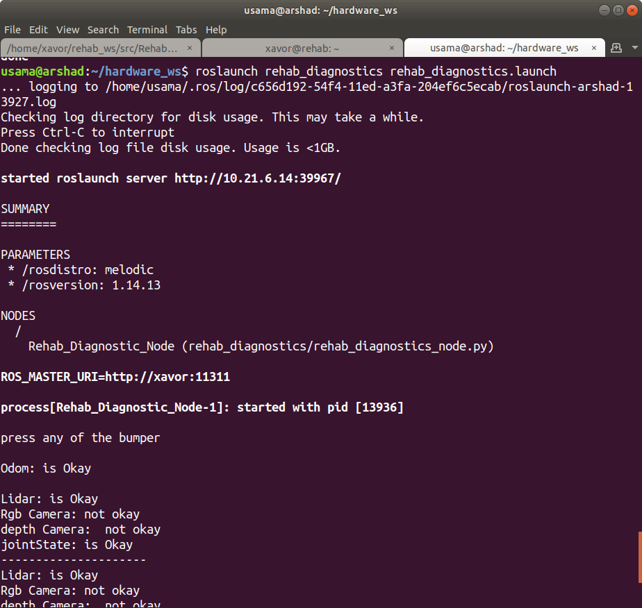

# rehab_diagnostics
This Repository contains the rehab_diagnostics_node that checks Bumber, Odom, LIDAR, RGB camera, Depth Camera, and JointState on the basis of the data being published on each sesnsors topic. Then it shows the status of each sensor on terminal.
## Working Logic
1st wait for 4 sec to check the bumper sensor, if someone press it will display the status, otherwise it will move on. But if somebody presses the bumper after that it will still display the status of the bumper sensors. Moreover, this 4-sec wait is also necessary for all the sensors to get the values.

2nd it tests the Odom by rotating the robot left and right.

Then it checks LIDAR, RGB camera, Depth Camera, and JointState respectively, and continuously publishes the status until the user kills the node.

## Setup 

1. Clone the complete project into your workspace ```src``` folder: 
   
   ```git clone https://github.com/Xavorcorp/rehab_diagnostics.git```

2. Compile everything using: 
   
   ```catkin_make```


## Usage 

  Run the following launch file to see the status of above mentioned sensors

  ```roslaunch rehab_diagnostics rehab_diagnostics.launch```
 
## Output
  The status on terminal will be shown as.
  
   
